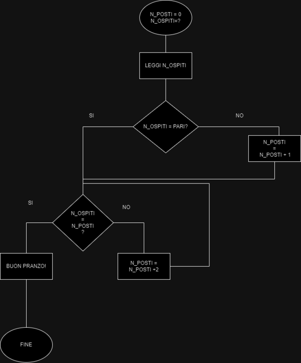

#Contare i posti a tavola di 2 in 2
DATI: numero posti=0 e numero ospiti=?
1. contiamo il numero dei posti
2. SE il numero degli ospiti non è pari aggiungi un posto 
3. ALTRIMENTI: numero ospiti e uguale a numero posti?
- se si: fine buon pranzo
- ALTRIMENTI: aggiungi due posti e ritorna al punto tre
